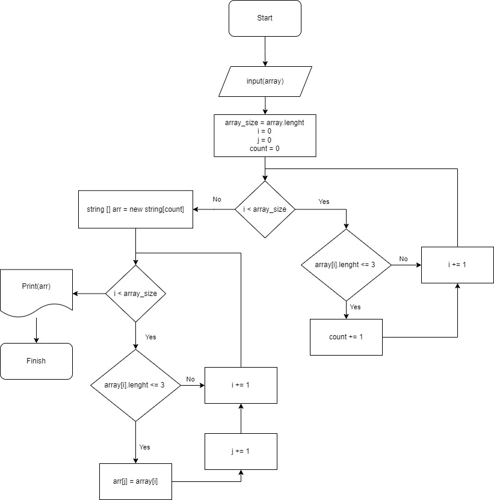

Описание решения задачи:
1. На вход получаем массив
2. Определяем его длину
3. Проходим по массиву, считаем количество элементов, длина которых не превышает 3-х символов
4. Так как известно количество эллементов, длина которых менее 4-х символов, создаём массив на это количество эллементов.
5. Второй проход по первому массиву, каждый элемент, длина которого менее 4-х символов также записывается в новый массив(второй)
6. Выводим новый массив в терминал.

<i>В задаче дополнил вывод старого массива, чтобы было видно разницу.
Ввод массива осуществляется через терминал.</i> 

**Блок схема задачи:**: 
